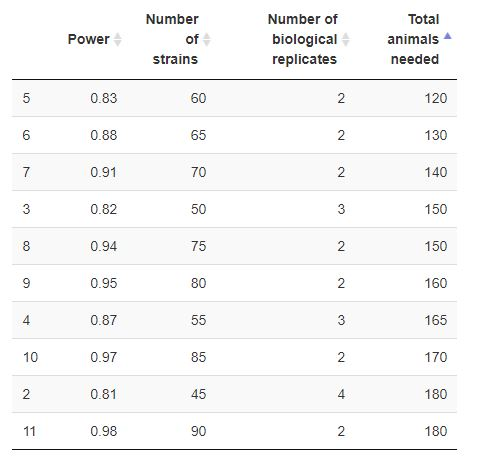

# Summary

Quantitative trait loci (QTL) studies are often carried out in two parent recombinant inbred (RI) populations
such as the BXD mouse family [@Taylor1973;@Andreux2012c;@Williams2016;@Williams2017a;@Li2018]. Although methods
have been available for many years to calculate power to detect effects in these populations [e.g. @Belknap1996;@Belknap1998],
there is not currently a quick, easy way for bench scientists to visualise the power to detect a loci under different 
experimental conditions. The power to detect a loci depends on several parameters including; the heritability 
of the trait, the locus effect size, the number of  strain being used, and the number of within strain biological 
replicates. The first two of these (heritability and locus effect size) are features of the trait, which have to
be estimated beforehand, whereas number of strains and number of biological replicates are decided by the 
experimenter. This app seeks to help an experimenter decide how many strains and biological replicates are 
necessary to have sufficient power to detect a QTL for a trait of interest.

Our app queries a dataframe build using a highly cited and commonly used method to calculate QTL power, R/qtlDesign, 
[https://cran.r-project.org/web/packages/qtlDesign/index.html; @Sen2007] the results of which are then presented to the user graphically. This allows the user to compare their power to detect a loci of a given size, given other common conditions. It is presented through a ShinyApp web interface (https://dashbrook1.shinyapps.io/bxd_power_calculator_app/). We provide two
outputs for this. The first is a figure showing the users power to detect a loci with different numbers of 
strains, given an input heritability, effect size, and range of biological replicates (Figure 1). The second is a table,
allowing the user to determine e.g. the minimum number of animals needed to achieve a certain power to detect
a QTL (Figure 2).

- Figure 1: Figure generated using the app. The power to detect a loci with a locus effect size
of 0.4 and heritability of 0.4 is shown, for between 10 and 150 strains, and between 2 and 10 biological replicates. A power cut-off of 0.8 is shown (i.e. under these conditions, a real locus will be detected 80% of the time). The power cut-off can also be selected by the user. 

- 

Figure 2: Table generated using the app. The number of strains and biologicala replicates needed to achieve a power of greater than 0.8 is shown, and the table is sorted by the total number of animals. This provides the user with a quick way to identify the most efficient experimental design (i.e. minimizing the number of animals used). These may not always be practical as many RI populations will have fewer than 150 available strains. The values used to produce this figure are the same as Figure 1. 

We also provide a graphic of the standard error density around the mean trait value for the two homzygotes 
at a locus of interest. This gives a visual representation of what the overall distribution of trait values
is expected to look like, given the locus effect size and the number of biological replicates (Figure 3). 

- Figure 3: Figure generated using the app. This demonstrates that although there are two distint populations (i.e. two homozygotes at a locus), the total distribution within the population will appear continuous. Values used to calculate this are a locus effect size of 0.4, and 10 biological replicates. 

This app will be useful at several stages. Firstly, when designing an experiment using a two parent RI population, such as the BXD, the user will be able to determine how many animals should be used, and provide a simple figure which can
be presented to reviewers when applying for funding. Secondly, the app can be used post-hoc, after an experiment has been carried out, to determine what the probability was to detect a loci, given the actual values known after the fact 
(e.g. heritability of the trait, and locus effect size). 

Early prototypes of the app have been used within the department for grant applications, and it is being
used in several current projects which will result in publications. 

# Acknowledgements

We acknowledge contributions from Danny Arends, Robert W. Williams and Śaunak Sen in discussing the design of the application.

# References
